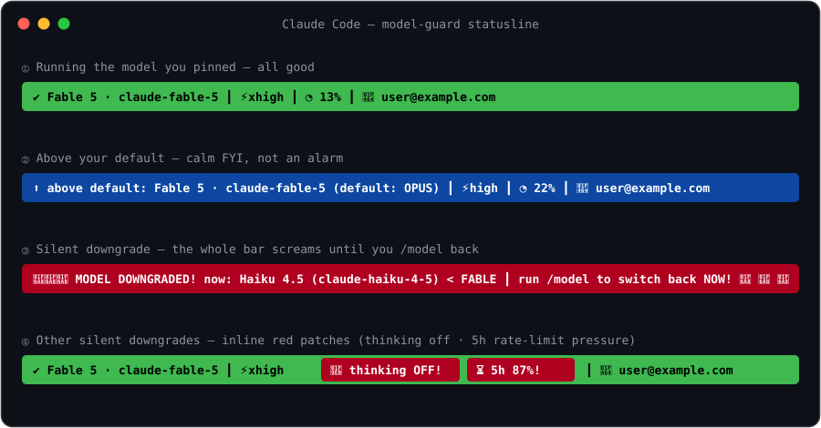
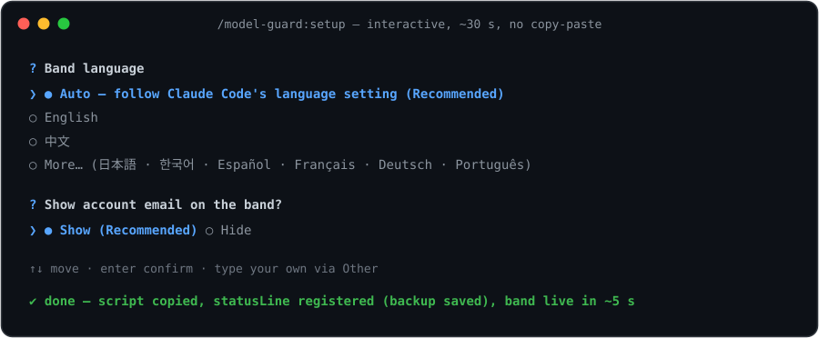

<div align="center">



# 🚨 model-guard

**抓住 Claude Code 静默降级的状态栏——1.1 起，被安全过滤器 flag 导致的那次降级还会被自动撤销。**

[](LICENSE)
[](https://claude.com/claude-code)
[](#安装)
[](#配置)

[English](README.md) · 简体中文

</div>

---

## 痛点

session 进行到一半撞上用量限额，Claude Code **静默**回退到更弱的模型——不闪、不响，只是你的结对程序员悄悄变笨了。你接着又聊了一个小时，纳闷代码怎么越写越糙，token 却一直在烧。

这个插件的由来就是这么一次真实事故：在被静默降级的模型上写废了半个 session，才注意到角落里那行小小的模型名。再也不想来第二次。

## 你会得到什么

每个 session 底部一条常驻、整行铺满的彩色横幅。不用去读它——你会**瞥见**它。

| 横幅 | 含义 |
|:---:|---|
| 🟩 `✔` | 模型与本机预期一致 |
| 🟦 `⬆` | 比默认**更强**——仅提示，不报警 |
| 🟥 `🚨` | **静默降级**——整条变红，提醒你 `/model` 切回 |
| 🟧 `🔁` | **已恢复**——被 flag 降级后，插件已把 session 切到恢复模型 |
| 🟦 `●` | 未配置预期——中性展示 |

模型型号只是一半。红色**内嵌警示补丁**负责其余的静默降级：

- ⚡ **思考强度**低于你配置的 `effortLevel`
- 🧠 **扩展思考**被关闭
- ⏳ **5 小时限额窗口 ≥ 80%**——强制回退的前兆，在降级发生*之前*就预警

外加日常实用信息：当前模型与思考强度、上下文用量、这个账号的 5 小时和 7 天用量（`⏳ 5h 37% · 7d 18%`）、当前登录账号（多账号切换党懂的）。

## 自动恢复

看见降级只是一半。眼下最常见的静默降级是**安全过滤器 flag**：Fable（或 Opus 5）的过滤器判定某条消息可疑，Claude Code 就把它改用 Opus 4.8 重跑一遍——然后整个 session 都留在 Opus 4.8 上。装上 1.1 的钩子后，session 会改成：

1. **停**——下一次工具调用被拒、这一轮直接结束（`PreToolUse`）；
2. **切**——一个独立的恢复进程往 session 自己的终端里按 Esc、输入 `/model <恢复模型>` 和 `/effort <强度>`，并等 Claude Code 的 `PostModelSwitch` 事件确认切换成功（插件的 `PreModelSwitch` 钩子回答 *allow*，所以不会被「缓存失效，确认切换？」的对话框卡住）；
3. **续**——发出继续提示词，被打断的任务在恢复模型上接着做。

默认恢复到 `claude-opus-5[1m]`、强度 `max`，继续提示词是「继续」（横幅语言为中文时；其他语言是 `Continue.`）。实测从降级到恢复模型吐出第一个字，整个往返约 8 秒。

第 2、3 步只在终端能被驱动时才存在：tmux 面板（`send-keys`）、zellij 面板（`action write-chars`），或开启了 socket 远程控制的 kitty（`kitty.conf` 里加 `allow_remote_control socket-only` 和 `listen_on unix:@kitty`，重启 kitty；`setup` 会主动提出帮你加）。tmux 和 zellij 不用配置任何东西。其他任何环境下插件只做第 1 步：这一轮停一次，横幅写明该 `/model` 切到哪，钩子不再插手。

在 tmux 或 zellij 里，按键是按面板编号送到指定的那一个面板，而不是「当前窗口」，所以一个面板在恢复时不会打字到旁边那个 session 里去。

两个值得知道的细节：

- 交互式 session 里 `/model <id>` 会顺手把 `<id>` 存成你新 session 的默认模型。插件在自己切完之后会把原来的默认值改回去，所以一次恢复不会改变你明天开新 session 用什么模型。
- 如果恢复模型自己也被 flag（Opus 5 → Opus 4.8），或者同一个 session 被降级超过 `RECOVER_MAX` 次，插件就只停不切。横幅会说明，用 `/model` 自己选。

## 安装

```
/plugin marketplace add ventusff/claude-model-guard
/plugin install model-guard@claude-model-guard
/model-guard:setup
```

最后一步是**交互式**的——方向键选两个问题就完事。它会拷贝脚本、写配置、把 `statusLine` 合并进 `~/.claude/settings.json`（先做带时间戳的备份）。不需要从 README 复制粘贴任何命令。

<div align="center"></div>

> **为什么还要 setup 这一步？** Claude Code 插件目前无法自行注册主状态栏（插件的 `settings.json` 只支持 `agent` 和 `subagentStatusLine` 两个键）。`setup` 是唯一逃不掉的一步，而且只需跑这一次：以后插件更新带来新脚本时，session 启动钩子会自己把装好的那份换成新的，并在屏幕上说一句。

**依赖：** bash 4+、[`jq`](https://jqlang.github.io/jq/) 和 `curl`；恢复钩子另外用到 `flock`、`setsid`（util-linux），有 `notify-send` 时会发一条桌面通知。没有守护进程。唯一的联网动作是状态栏拿 Claude Code 存下来的登录令牌，去问 Claude Code 自己的用量接口（`/usage` 命令用的那个）要这个账号的限额用量，每台机器最多 30 秒问一次；别的什么都不往外发。插件钩子在 session 启动时加载——装好或更新后请重开 session。

## 「降级」是怎么判定的

**预期模型**——命中即止：

1. `~/.claude/model-guard.conf` 的 `EXPECTED_MODEL`（`grep -Ei` pattern，手动覆盖）
2. `~/.claude/statusline-expected-model`（旧版覆盖文件）
3. `~/.claude/settings.json` 里钉住的 `model`（`opus[1m]` → `opus`；`default` 视为无预期）

**强度序：** 先看家族 `fable/mythos > opus > sonnet > haiku`，同家族再比版本号（`claude-opus-5 > claude-opus-4-8`）。

- 实际模型**低于**预期 → 🟥 整行报警。
- 认不出的型号计 0 分 → 🟥。无法证明它不更弱，就不猜——保守是设计原则。
- 实际**高于**预期 → 🟦 冷静的蓝色。白捡的升级不算急事。
- 自动降级（Claude Code 的 `PostModelSwitch` 事件，来源为 `auto` 或 `resume`）用同一套强度序判断要不要启动恢复。

## 用量数字从哪来

5 小时和 7 天这两个百分比是**你这个账号的**：状态栏拿 Claude Code 存下来的登录令牌，去问 Claude Code 自己 `/usage` 命令用的那个用量接口。令牌依次从环境变量、macOS 钥匙串、`~/.claude/.credentials.json` 里找。同一台机器上所有 session 共用一份读数，30 秒内不重复问。

它故意不用 Claude Code 递给状态栏的 `rate_limits`。那个值是某一个 session 最后一次从接口响应头里读到的数：这个 session 不再收到回复它就不动，`/login` 换号也不会清掉。换号之后它照旧报的是上一个账号的数，而且还在涨，因为切换那一刻没跑完的请求仍然记在旧账号上。这里换号等于换了缓存的键，下一次刷新立刻重新问；答案回来之前这一段留空，绝不显示另一个账号的数。没有登录令牌的 session（API key、Bedrock、Vertex）退回用 Claude Code 递来的值。

## 配置

全部配置在 `~/.claude/model-guard.conf`（由 `setup` 创建，也可手改）：

| 键 | 默认 | 作用 |
|---|---|---|
| `LANGUAGE` | `auto` | 横幅语言。`auto` 跟随 Claude Code 的 `language` 设置，否则英文。可选：`en` `zh` `ja` `ko` `es` `fr` `de` `pt` |
| `SHOW_ACCOUNT` | `true` | 显示当前登录账号邮箱（实时读 `~/.claude.json`，换号自动跟随） |
| `SHOW_CONTEXT` | `true` | 显示上下文用量，如 `◔ 13%` |
| `SHOW_LIMIT` | `true` | 显示当前登录账号的 5 小时和 7 天用量，如 `⏳ 5h 37% · 7d 18%`（见上文） |
| `LIMIT_WARN_AT` | `80` | 5 小时限额用量达到 N% 时红色补丁预警。`off` 关闭 |
| `EXPECTED_MODEL` | *(自动)* | 手动指定预期模型 pattern，如 `opus\|fable` |
| `RECOVER` | `on` | 恢复钩子总开关（`off` 则停与切都不做） |
| `RECOVER_MODEL` | `claude-opus-5[1m]` | 自动降级后要切到的模型 |
| `RECOVER_EFFORT` | `max` | 切过去之后执行的 `/effort` 强度（`off` 不动） |
| `RECOVER_PROMPT` | *(按语言)* | 用来接着做被打断任务的提示词 |
| `RECOVER_CHANNEL` | `auto` | 按键怎么送进 session：`auto`（先 tmux 面板，再 zellij 面板，再 kitty）、`tmux`、`zellij`、`kitty`、`dryrun`（只记日志）、`none` |
| `RECOVER_MAX` | `3` | 每个 session 允许的自动恢复次数，超过就只停不切 |
| `DEBUG` | *(关)* | `true` 时把每次钩子输入追加到 `$XDG_RUNTIME_DIR/model-guard/debug.log` |

随时重跑 `/model-guard:setup` 交互式改配置。

## 设计细节

<details>
<summary><b>为什么用 truecolor 而不是普通 ANSI 颜色？</b></summary>

终端主题会重映射 16 个基础 ANSI 颜色——「红底」可能被渲染成粉底，对比度恰好在你最需要报警醒目的时候塌掉。model-guard 输出 **truecolor** 转义序列（`COLORTERM` 不支持时回退到固定 256 色立方），完全绕过主题调色板。

三对前景/背景色均按 WCAG 对比度 ≥ 7:1（AAA）选定：

| 状态 | 颜色 | 对比度 |
|---|---|---|
| OK | `#000000` on `#3FB950` | 8.3 : 1 |
| ALARM | `#FFFFFF` on `#B00020` | 7.3 : 1 |
| INFO | `#FFFFFF` on `#0D47A1` | 8.6 : 1 |
| RECOVERED | `#000000` on `#FFB300` | 11.4 : 1 |

不用闪烁（SGR 5）——跨终端渲染不可控。

</details>

<details>
<summary><b>自动恢复是怎么做的？为什么要往终端里打字？</b></summary>

Claude Code 的钩子能看见模型切换（`PostModelSwitch` 带 `from_model`、`to_model` 和 `source`，自动回退时 `source` 是 `auto`），也能否决用户发起的切换（`PreModelSwitch`），但没有任何钩子能*设置* session 的模型；一个正在运行的交互式 session，除了键盘也没有别的控制入口。所以插件做的就是你手动会做的那几步——Esc、`/model`、`/effort`、「继续」——通过终端自己的远程控制接口送进去，而且从不靠猜：每一步都等到回执（Claude Code 的会话登记表变成空闲、`PostModelSwitch` 事件、命令在会话记录里的回显）才走下一步。

钩子在 `$XDG_RUNTIME_DIR/model-guard/` 里为每个 session 记一个小 JSON：

| 状态 | 含义 |
|---|---|
| `pending` | 已降级且有按键通道，恢复进程正在启动 |
| `switching` | 恢复进程正在输入切换命令 |
| `recovered` | 降级之后模型换过了（恢复进程换的，或你自己换的） |
| `stopped` | 已降级但不自动切（没有通道、恢复模型自己也被 flag、恢复途中又被降级、或达到 `RECOVER_MAX`）：这一轮停一次，之后钩子一律放行 |

`SessionStart` 会清掉过期状态（被锁定的回退模型在恢复会话时会以 `source=resume` 的 `PostModelSwitch` 重新出现，这会触发切换但不会发继续提示词）；`SessionEnd` 负责收尾。`tests/run.sh` 用合成的钩子输入和 `dryrun` 通道把整台状态机跑一遍。

</details>

<details>
<summary><b>横幅怎么做到任意终端宽度都整行铺满？</b></summary>

脚本在输出尾部垫约 300 个空格（报警态则是一串 🚨），超出终端宽度的部分被 TUI 截掉，所以色带永远铺满整行——不需要探测宽度。

</details>

<details>
<summary><b><code>setup</code> 到底动了什么？</b></summary>

- 拷贝状态栏脚本到 `~/.claude/model-guard.sh`
- 把你的选择写进 `~/.claude/model-guard.conf`
- 向 `~/.claude/settings.json` 合并一个 `statusLine` 块——先做带时间戳的备份，不碰其他任何键
- 如果你之前有别的状态栏，会被保存下来，**卸载时自动还原**

</details>

## 卸载

```
/model-guard:remove
```

注销状态栏（还原你之前的配置）、可选删除脚本、配置文件和每个 session 的状态文件、保留 settings 备份。之后可在 `/plugin` 里移除插件本体——恢复钩子随插件本体一起走。

## License

[MIT](LICENSE) © [ventusff](https://github.com/ventusff)
